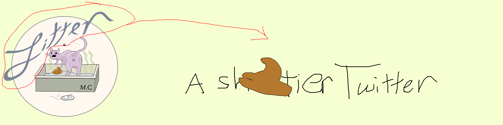

Litter is a (backend-only for now) API for a Twitter-like social media site. Built with Spring Boot, MongoDB, and enough
cloud infrastructure to make me cry when I get my monthly Azure bill.

> [!TIP]
> **TL;DR:** It's like Twitter, but smaller.
> And ~~better~~.
> It deploys itself to Azure AKS with one Terraform command ([*almost*](terraform/README.md)).
> Want to run it? Skip to the [deployment section](#rocket-deployment-instructions).

## Table of Contents

- [Features](#rocket-features)
- [Tech Stack](#wrench-tech-stack)
- [Deployment Instructions](#rocket-deployment-instructions)
- [API Documentation](#book-api-documentation)
- [Project Structure](#building_construction-project-structure)
- [Infrastructure](#cloud-infrastructure)
- [License](#scroll-license)
- [Acknowledgments](#heart-acknowledgments)

## :rocket: Features

* Reactive Spring Boot backend with WebFlux
* Token-based authentication with JWT
* Message publishing and subscription system
* Automated deployment to Azure AKS
* Full CI/CD pipeline with GitHub Actions
* Comprehensive test suite with JUnit 5
* Infrastructure as Code with Terraform
* Kubernetes deployment via Helm chart
* Docker Compose for local development
* API documentation with Postman

## :wrench: Tech Stack

| Category                                | Technologies                                                                                  |
|-----------------------------------------|-----------------------------------------------------------------------------------------------|
| Backend                                 | Spring Boot, WebFlux                                                                          |
| Frontend                                | N/A (maybe later if I still care — I've been messing about with a possible Angular front end) |
| Database                                | MongoDB 8.*x* via Spring Data (Reactive)                                                      |
| Cloud Platform                          | Azure: _Azure Kubernetes Service (AKS), Key Vault, DNS Zone_                                  |
| [Infrastructure](#cloud-infrastructure) | Terraform, Helm, Kubernetes, Docker                                                           |
| Build Tools                             | Gradle, GitHub Actions                                                                        |
| Testing                                 | JUnit 5, TestContainers, Postman                                                              |
| Security                                | JWT, Azure Key Vault, TLS/SSL, Argon2 password hashing (Spring Security)                      |

## :rocket: Deployment Instructions

Pick your deployment method:

* [**Terraform**](terraform/README.md) (Recommended) - Full cloud deployment
* [**Helm**](chart/README.md) - Manual Kubernetes deployment
* [**Docker Compose**](compose/README.md) - Local development

## :book: API Documentation

TODO: Document the API endpoints at the controller level using `springdoc-openapi` or with AsciiDoc using
`asciidoctor-spring-autoconfigure`.

## :building_construction: Project Structure

```
litter-test
├── chart/              # Helm templates and values
│
├── compose/            # Docker Compose files
│
├── src/
│    ├── main/          # Application source code
│    └── test/          # Unit and integration tests
│
├── terraform/          # IaC configuration
│
├── build.gradle        # Gradle build file
├── gradle.properties   # Gradle properties
├── settings.gradle     # Gradle settings
│
├── Dockerfile          # Docker build file
│
└── README.md           # Wait a minute...this is pretty meta
```

## :cloud: Infrastructure

```mermaid
---
config:
  theme: dark
  look: handDrawn
  layout: dagre
---
flowchart TB
 subgraph GHA_subgraph["GitHub Actions Workflow"]
        B["Build & Test w/ Gradle"]
        I["Build Image"]
        P["Push to Registry"]
        TP["Terraform Plan"]
        TA["Terraform Apply"]
  end
 subgraph GH_subgraph["GitHub"]
        GHA_subgraph
        GHCR["GHCR"]
  end
 subgraph DNS_subgraph["DNS Resource Group"]
        DNS["Azure DNS Zone"]
  end
 subgraph KV_subgraph["Key Vault Resource Group"]
        KV["Key Vault"]
  end
 subgraph in_subgraph["Ingress & TLS"]
        ING["NGINX Ingress"]
        ACME["Cert Manager"]
  end
 subgraph app_subgraph["Application Tier"]
        APP1["Litter App Pod 1"]
        APP2["Litter App Pod 2, etc."]
  end
 subgraph db_subgraph["Database Tier"]
        MDB["MongoDB Pod"]
        PV["Persistent Volume"]
        CAT@{ img: "res/img/catinlitterbox.svg", h: 100, w: 100, pos: "b"}

  end
 subgraph res_subgraph["Kubernetes Resources"]
        SEC["K8s Secrets"]
        SVC["LoadBalancer Service"]
        app_subgraph
        db_subgraph
  end
 subgraph aks_subgraph["Azure Kubernetes Service"]
        in_subgraph
        res_subgraph
  end
 subgraph aks_rg_subgraph["AKS Resource Group"]
        aks_subgraph
  end
 subgraph az_subgraph["Azure Cloud"]
        DNS_subgraph
        KV_subgraph
        aks_rg_subgraph
  end
    B --> P
    P --> TP
    TP --> TA
    DR["Domain Registrar"] -- assign nameserver --> DNS
    P -- push image --> GHCR
    TA -- deploy infrastructure --> AKS["AKS"]
    DNS -- DNS records --> ING
    KV -- secrets source --> SEC
    SEC -- mount secrets --> APP1 & APP2 & MDB
    ING -- route traffic --> SVC
    ACME -- TLS certs --> ING
    SVC -- load balance --> APP1 & APP2
    APP1 -- read/write --> MDB
    APP2 -- read/write --> MDB
    MDB -- provision/claim --> PV
    MDB -- download brown load --> CAT
     I:::github
     P:::github
     TP:::github
     TA:::github
     GHCR:::github
     DNS:::azure
     KV:::azure
     ING:::k8s
     ACME:::k8s
     APP1:::k8s
     APP2:::k8s
     MDB:::k8s
     PV:::k8s
     SEC:::k8s
     SVC:::k8s
     DR:::external
    classDef azure fill:#0072C6,color:white,stroke:white
    classDef k8s fill:#326CE5,color:white,stroke:white
    classDef github fill:#24292E,color:white,stroke:white
    classDef external fill:#cccccc,color:black,stroke:black
```

> [!TIP]
> The infrastructure is defined entirely in code:
>
> * See [Terraform Configuration](terraform/README.md)

## :scroll: License

This project is licensed under the GNU General Public License v3.0 in case someone wants to clone this for some reason;
see the [LICENSE](LICENSE) file for details.

## :heart: Acknowledgments

* My caffeine addiction, for making this possible
* The Azure free tier, for not bankrupting me during development
* The original Twitter, for being so bad that I had to try to make my own

> [!IMPORTANT]
> Found a bug? Have a feature request? Just want to let me know that more than 2 eyeballs have seen this? Open an issue!
